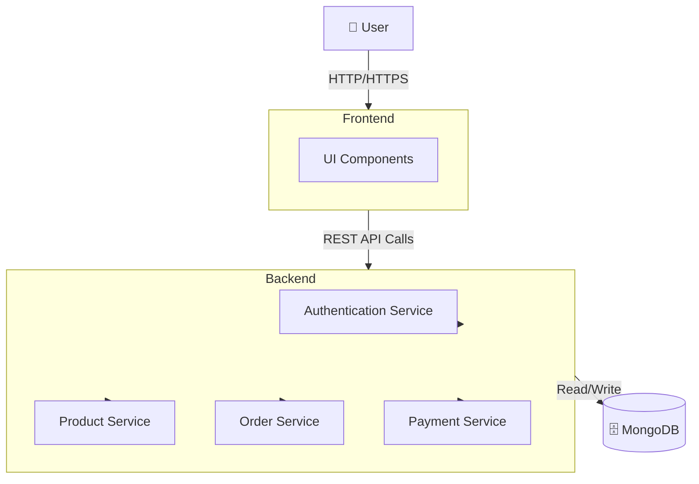

# 🛒 E-Commerce Platform  

This repository contains the **E-commerce Platform**, which includes a **backend REST API** (for managing products, orders, users, payments, etc.) and a **modern frontend application** built with Angular and Tailwind CSS. The goal of this project is to provide a scalable full-stack e-commerce solution.  

---

## 🚀 Features  

### Backend (Node.js/Express API)
- 🔑 User authentication & authorization (JWT-based)  
- 📦 Product management (CRUD operations)  
- 🛍️ Cart & checkout APIs  
- 💳 Order management & payment integration  
- 📊 Admin endpoints for managing store data  

👉 **API Documentation:** [Postman Docs](https://documenter.getpostman.com/view/5709532/2s93JqTRWN)  

---

### Frontend (Angular)
- 🎨 UI built with **Angular** + **Tailwind CSS** + **Flowbite**  
- 🛍️ Product listing, filtering & searching  
- 🛒 Shopping cart & checkout flow  
- 👤 User login, registration & profile management  
- 📦 Order history & tracking  
- 📱 Responsive & mobile-first design  

---

## 🛠️ Tech Stack  

**Backend:**  
- Node.js / Express.js  
- MongoDB  
- JWT for authentication  
- Postman (API documentation/testing)  

**Frontend:**  
- Angular  
- Tailwind CSS  
- Flowbite (UI components)  
- TypeScript  

---

## 🏗️ System Architecture  


---

## 📌 Example API Usage  

### 🔐 User Registration  

**cURL**
```bash
curl -X POST http://localhost:5000/api/auth/register \
  -H "Content-Type: application/json" \
  -d '{"name":"John Doe", "email":"john@example.com", "password":"123456"}'
```

**Angular (HttpClient)**  
```ts
this.http.post('/api/auth/register', {
  name: 'John Doe',
  email: 'john@example.com',
  password: '123456'
}).subscribe(res => console.log(res));
```

---

### 🔑 User Login  

**cURL**
```bash
curl -X POST http://localhost:5000/api/auth/login \
  -H "Content-Type: application/json" \
  -d '{"email":"john@example.com", "password":"123456"}'
```

**Angular**
```ts
this.http.post('/api/auth/login', {
  email: 'john@example.com',
  password: '123456'
}).subscribe(token => localStorage.setItem('token', token));
```

---

### 🛍️ Fetch Products  

**cURL**
```bash
curl -X GET http://localhost:5000/api/products
```

**Angular**
```ts
this.http.get('/api/products')
  .subscribe(products => this.products = products);
```

---

### 🛒 Add Item to Cart (authorized endpoint)  

**cURL**
```bash
curl -X POST http://localhost:5000/api/cart \
  -H "Content-Type: application/json" \
  -H "Authorization: Bearer <your-jwt-token>" \
  -d '{"productId":"12345", "quantity":2}'
```

**Angular**
```ts
this.http.post('/api/cart', {
  productId: '12345',
  quantity: 2
}, {
  headers: { Authorization: `Bearer ${localStorage.getItem('token')}` }
}).subscribe(res => console.log(res));
```

---

## ⚡ Getting Started  

### Prerequisites  
- Node.js >= 16  
- npm or yarn  
- MongoDB instance  
- Angular CLI (`npm install -g @angular/cli`)  

### Clone the Repository  
```bash
git clone https://github.com/your-username/ecommerce-platform.git
cd ecommerce-platform
```

### Backend Setup  
```bash
cd backend
npm install
cp .env.example .env   # configure environment variables
npm run dev
```

### Frontend Setup  
```bash
cd frontend
npm install
ng serve
```

App will run at: [http://localhost:4200](http://localhost:4200)

---

## 📚 API Reference  
👉 [Full Postman API Docs](https://documenter.getpostman.com/view/5709532/2s93JqTRWN)

---

## 🧪 Testing  
```bash
cd backend
npm test
```

---

Would you like me to **add a "Quick Demo GIF/Screenshots" section** to show the UI in action inside the README (like browse product → add to cart → checkout)? That could make it look more polished for GitHub readers.
